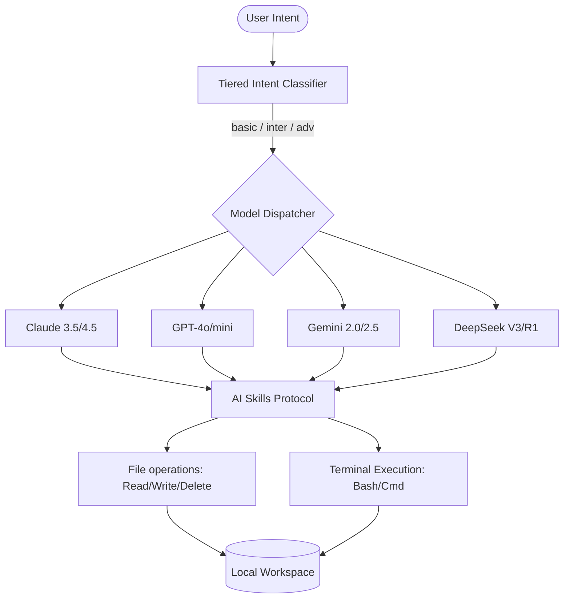

# Yazıcı — The Autonomous Logic Printer

A browser-based AI IDE that treats software development as a fluid expression of logic, not a construction site.

**License:** GPL v3 | **Version:** 3.0.0 | **Stack:** TypeScript, Express, SQLite

---

> [!IMPORTANT]
> **Experimental Autonomous Tooling**
> Yazıcı is a high-performance development engine designed to interact directly with your local workspace. It executes file operations and terminal commands based on AI intent. Use with caution in production environments.

## Why "Yazıcı"?

**Yazıcı** (Turkish for *Printer*) represents a fundamental shift in how we perceive the act of creation. 

In traditional paradigms, we "build" software—a metaphor of bricks, mortar, and manual labor. Yazıcı rejects this. Our philosophy is rooted in a different truth:

**Development is not a construction; it is a print.**

- **The Logic is the Ink**: Your intent and architectural vision are the fluid substance.
- **The AI is the Nozzle**: The large language model is the high-precision instrument that directs the flow.
- **The Codebase is the Paper**: The local file system is the medium upon which the logic is materialized.

We do not build code—we print it. Yazıcı is the mechanism that allows logic to flow from thought to disk with zero friction.

## What is Yazıcı?

Yazıcı is an autonomous development engine that bridges the gap between high-level reasoning and low-level execution. It is a browser-based IDE that doesn't just suggest code—it performs it. 

Equipped with a custom **Skills Protocol**, Yazıcı can read, write, delete files, and execute terminal commands across your local workspace, orchestrated by a sophisticated multi-model routing system.

## Architecture



## Core Features

### 1. Multi-Model Intelligence
Yazıcı doesn't lock you into a single provider. It intelligently routes requests across a pool of state-of-the-art models based on task complexity.

| Provider | Basic Tier | Intermediate Tier | Advanced Tier |
| :--- | :--- | :--- | :--- |
| **Claude** | Claude Haiku | Claude Sonnet | Claude Opus |
| **Gemini** | Gemini Flash | Gemini Flash | Gemini Pro |
| **OpenAI** | GPT-4o-mini | GPT-4o | GPT-4o |
| **DeepSeek** | DeepSeek Chat | DeepSeek Chat | DeepSeek Reasoner |

### 2. Tiered Intent Classification
To optimize for both speed and cost, Yazıcı classifies every user message before processing:
- **Basic**: Trivial edits, greetings, or formatting.
- **Inter**: Feature implementation, code explanation, and testing.
- **Adv**: Complex architecture, deep debugging, and security audits.

### 3. AI Skills Protocol
Yazıcı communicates with your system through a structured protocol defined in `SKILLS.md`. This allows the AI to:
- Create and overwrite files with surgical precision.
- Delete obsolete or redundant assets.
- Execute build scripts, install dependencies, and run tests directly.

## File Structure

```text
GateAi/
├── src/
│   ├── core/           # Routing and Intent Logic
│   ├── providers/      # LLM API Adapters (Claude, Gemini, etc.)
│   ├── routes/         # Express API Endpoints
│   ├── services/       # Key Management and Database
│   └── server.ts       # Entry Point
├── public/             # Browser IDE Frontend
├── SKILLS.md           # AI Interaction Protocol
├── yazici.sh / .bat    # Quick Launch Scripts
└── package.json        # Dependencies and Metadata
```

## Quick Start

### Prerequisites
- Node.js (v20+)
- API Keys for at least one provider (Claude, OpenAI, Gemini, or DeepSeek)

### Installation
1. Clone the repository to your local machine.
2. Install dependencies:
   ```bash
   npm install
   ```
3. Start the development server:
   ```bash
   npm run dev
   ```
4. Open your browser and navigate to `http://127.0.0.1:3147`.

### Configuration
API keys are managed via the built-in Settings menu in the IDE or stored in the local SQLite database.

## License

Copyright (C) 2026 Yazıcı Contributors.

This program is free software: you can redistribute it and/or modify it under the terms of the **GNU General Public License v3.0**. See `LICENSE` for details.

## THE PROJECT İS NOT FİNİSHED
i may have made mistakes, breaking the ide. İ dont have any backup so i will rewrite in a later time. keep in mind.
